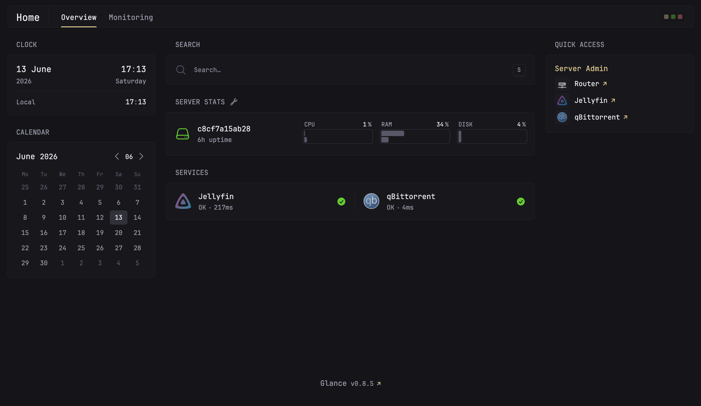

# Home Server



A comprehensive Docker-based home server setup featuring a media management system, torrent client, and unified dashboard for monitoring and managing all services.

## 🚀 Features

- **Glance** - Beautiful home dashboard with service monitoring
- **Jellyfin** - Open-source media server for movies and TV shows
- **qBittorrent** - Lightweight torrent client with web UI

All services are containerized and managed with Docker Compose for easy deployment and scaling.

## 📋 Prerequisites

- Docker ([Installation Guide](https://docs.docker.com/engine/install/))
- Docker Compose ([Installation Guide](https://docs.docker.com/compose/install/))
- Linux-based system (or Docker Desktop on macOS/Windows)
- At least 2GB RAM available
- 20GB+ disk space for media storage (depending on your library size)

## 🔧 Installation

### 1. Clone the Repository

```bash
git clone <your-repo-url>
cd home-server
```

### 2. Configure Environment Variables

Copy the example environment file and configure it:

```bash
cp .env.example .env
```

Edit `.env` with your system settings:

```env
# User/Group IDs for qBittorrent container (run 'id' to find yours)
PUID=1000
PGID=1000

# Your timezone (e.g., America/New_York, Europe/London, Africa/Casablanca)
TZ=Your/Timezone

# Your server's local IP address (required for Glance dashboard)
SERVER_IP=192.168.x.x
```

### 3. Configure Glance Dashboard (Optional)

Edit `services/glance/glance.yml` to customize the dashboard appearance and widgets. The configuration supports:
- Custom branding and colors
- Multiple dashboard pages
- Service monitoring
- Quick access bookmarks
- System stats widgets

## 🚀 Usage

### Starting the Services

```bash
# Start all services in the background
docker-compose up -d

# View logs
docker-compose logs -f

# View specific service logs
docker-compose logs -f jellyfin
docker-compose logs -f qbittorrent
docker-compose logs -f glance
```

### Stopping the Services

```bash
docker-compose down
```

### Updating Services

```bash
# Pull latest images and restart
docker-compose pull
docker-compose up -d
```

## 🌐 Accessing Services

Once the services are running, access them via your local network:

| Service | URL | Default Port | Purpose |
|---------|-----|--------------|---------|
| **Glance** | `http://<SERVER_IP>:8080` | 8080 | Dashboard & monitoring |
| **Jellyfin** | `http://<SERVER_IP>:8096` | 8096 | Media server (movies & TV) |
| **qBittorrent** | `http://<SERVER_IP>:8081` | 8081 | Torrent client |

Replace `<SERVER_IP>` with your actual server IP address (set in `.env`).

## 📁 Directory Structure

```
home-server/
├── docker-compose.yml          # Docker services configuration
├── .env                         # Environment variables (not in git)
├── .env.example                 # Environment template
├── .gitignore                   # Git ignore rules
├── README.md                    # This file
│
├── services/                    # Service configurations
│   ├── glance/
│   │   └── glance.yml          # Glance dashboard config
│   ├── jellyfin/
│   │   └── config/             # Jellyfin configuration & data
│   │       ├── config/         # XML config files
│   │       ├── data/           # Playlists, watched state
│   │       ├── log/            # Jellyfin logs
│   │       ├── metadata/       # Media metadata cache
│   │       ├── plugins/        # Installed plugins & configs
│   │       └── root/           # Library definitions
│   └── qbittorrent/
│       └── config/             # qBittorrent configuration
│           └── qBittorrent/    # App config & data
│               ├── BT_backup/  # Torrent backups
│               ├── GeoDB/      # IP geolocation database
│               ├── logs/       # qBittorrent logs
│               └── rss/        # RSS feeds config
│
└── data/                        # Media storage
    └── media/
        ├── movies/             # Movie library
        ├── series/             # TV series library
        └── downloads/          # Downloaded content
            └── incomplete/     # In-progress downloads
```
